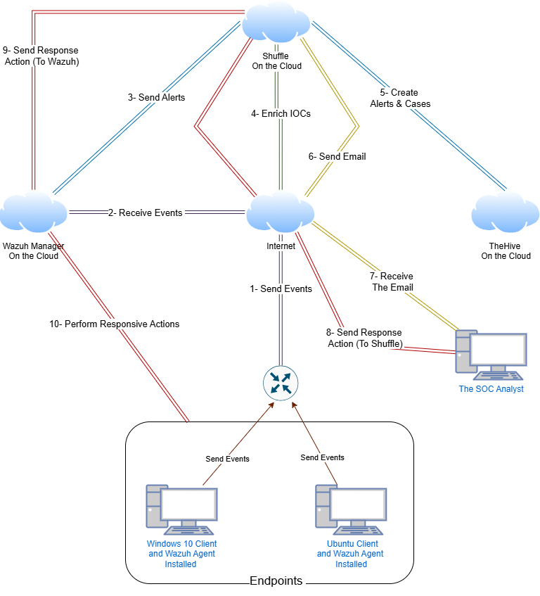

# Automated SOC Workflow for Incident Response

This project demonstrates the design and implementation of an automated Security Operations Center (SOC) workflow for incident response using open-source technologies. The solution integrates **Wazuh** (SIEM/XDR), **Shuffle** (SOAR), and **TheHive** (case management) to enhance threat detection, automate response actions, and streamline case management in a cloud-based environment.

---

## 🏗️ System Architecture

The automated SOC workflow follows this process:

1. **Event Collection**: Wazuh agents on endpoints collect and send telemetry data to the Wazuh Manager.
2. **Event Processing**: The Wazuh Manager processes events and triggers alerts based on custom and built-in detection rules.
3. **Alert Enrichment**: Shuffle enriches alerts using threat intelligence from **VirusTotal** (e.g., IP reputation, file hash analysis).
4. **Case Creation**: Enriched alerts are forwarded to **TheHive**, where structured cases are created for investigation.
5. **Notification & Response**: Shuffle sends email notifications to SOC analysts, who can initiate automated responses (e.g., block IP, isolate endpoint) via Shuffle and Wazuh.

---

## 🛠️ Tools & Technologies

| Tool          | Role                          |
|---------------|-------------------------------|
| **Wazuh**     | SIEM/XDR – threat detection   |
| **Shuffle**   | SOAR – workflow automation    |
| **TheHive**   | Case management               |
| **VirusTotal**| Threat intelligence enrichment|

---

## 🔧 Key Features

- **Real-time Monitoring**: Continuous log collection and analysis via Wazuh agents.
- **Custom Detection Rules**: Example: Mimikatz detection using `OriginalFileName`.
- **Automated Enrichment**: IOCs are automatically enriched with VirusTotal.
- **Case Management**: Incidents are organized and tracked in TheHive.
- **Email Notifications**: SOC analysts are alerted via automated emails.
- **Response Actions**: Block IPs, isolate endpoints, and more via Shuffle.

---

## 🧪 Testing Scenarios

Two attack scenarios were simulated to validate the workflow:

### 1. Mimikatz Malware Execution
- Custom Wazuh rule detected renamed Mimikatz executable.
- Shuffle enriched the hash via VirusTotal and created a case in TheHive.
- Email notification was sent to the SOC analyst.

### 2. SSH Brute-Force Attack
- Wazuh detected multiple failed SSH login attempts.
- Shuffle extracted the attacker IP, enriched it, and created a TheHive alert.
- Analyst could block the IP via iptables through Shuffle.

---

## 📈 Evaluation Metrics

- **Mean Time to Detect (MTTD)**: Time from incident start to detection.
- **Mean Time to Respond (MTTR)**: Time from detection to resolution.

---

